# Secure Online Examination System

A client–server examination system. Examiners register students, create and publish exams, and release results. Students enroll, sit timed exams, submit signed answers and receive signed results. Every step is protected with **AES**, **RSA**, **SHA-256**, **HMAC**, **digital signatures** and **TLS 1.3**.

The server is written in Python. Its only dependency is [`cryptography`](https://cryptography.io); everything else is in the standard library. There are two transports over one backend:

- a TLS socket protocol, used by the command-line clients
- an **HTTPS JSON API** (see [docs/API.md](docs/API.md)), used by the **web frontend** in [frontend/](frontend/)

The web frontend is plain JavaScript modules with no build step and no third-party code. All cryptography runs in the browser through WebCrypto. Keys are generated on the device, answers are signed there, and every server signature is checked against a pinned key.

---

## Screenshots

The React landing page (`npm run dev`, http://localhost:3000), which links to the exam app:


The secure exam web app (https://localhost:5173), served by the Python server:

<table>
<tr>
<td width="50%" valign="top">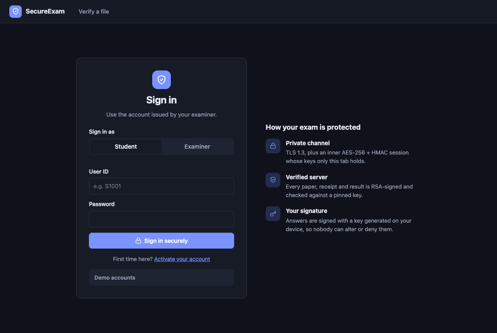<br><b>Sign in</b>: students and examiners sign in over TLS 1.3 plus an inner AES-256 + HMAC session.</td>
<td width="50%" valign="top">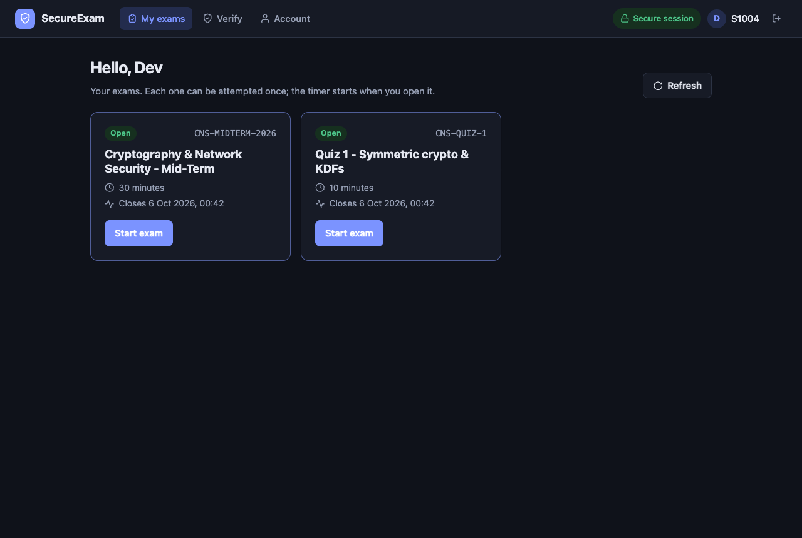<br><b>My exams</b>: the exams open to the student. Each can be attempted once.</td>
</tr>
<tr>
<td width="50%" valign="top">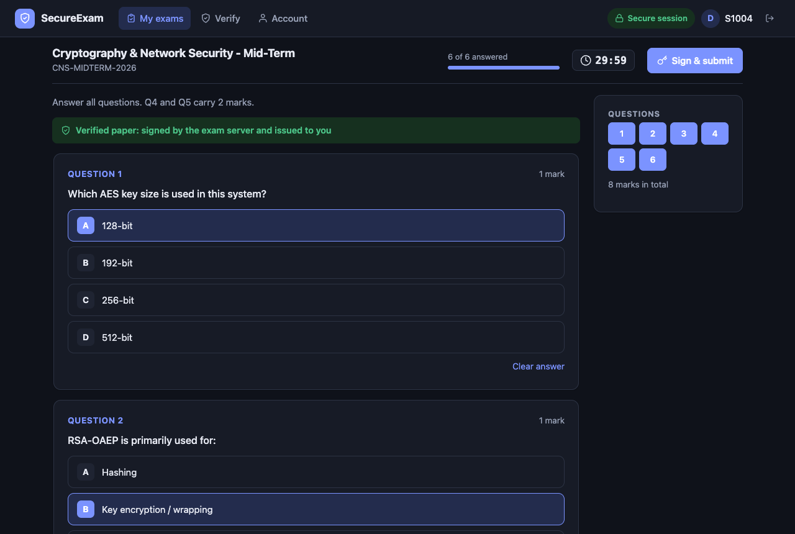<br><b>Timed exam</b>: the paper's server signature is checked before it is shown. Answers autosave, and the exam auto-submits when time runs out.</td>
<td width="50%" valign="top">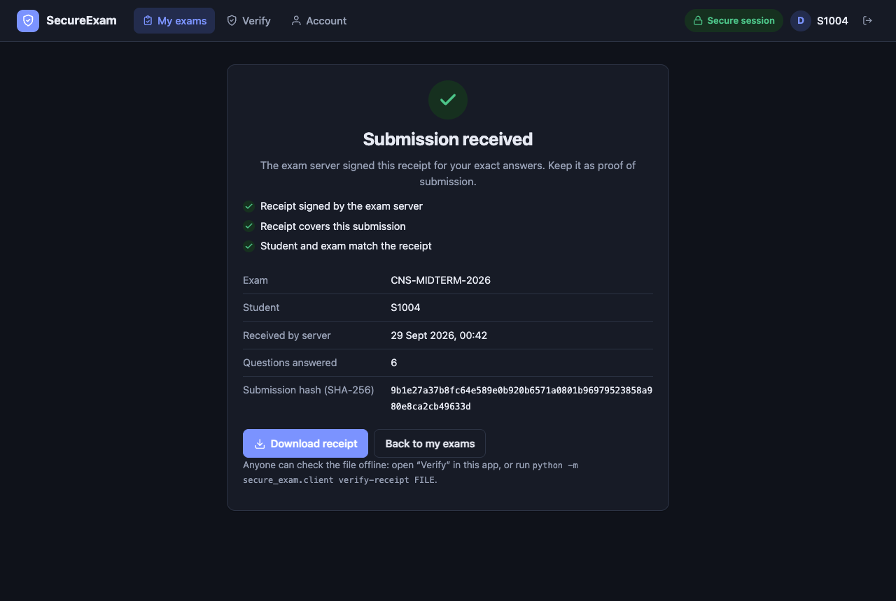<br><b>Signed receipt</b>: the server signs a receipt over the SHA-256 hash of the exact answers.</td>
</tr>
<tr>
<td width="50%" valign="top">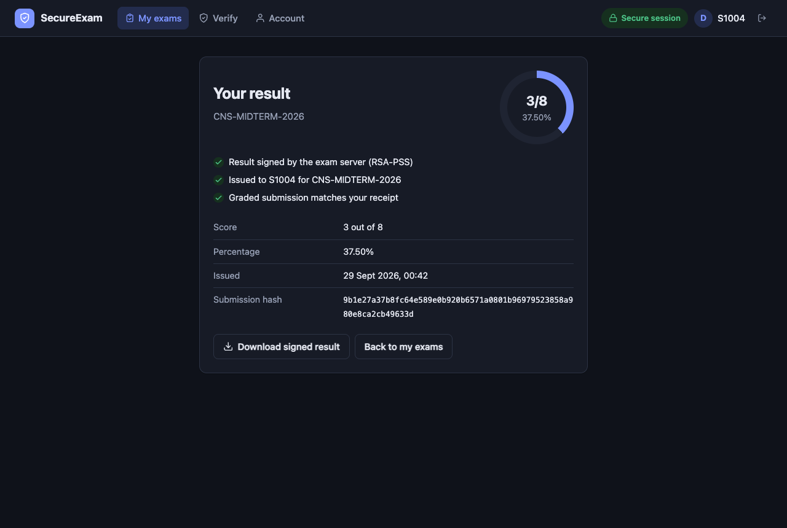<br><b>Signed result</b>: the RSA-PSS signature on the result is checked in the browser and tied to the student's receipt.</td>
<td width="50%" valign="top">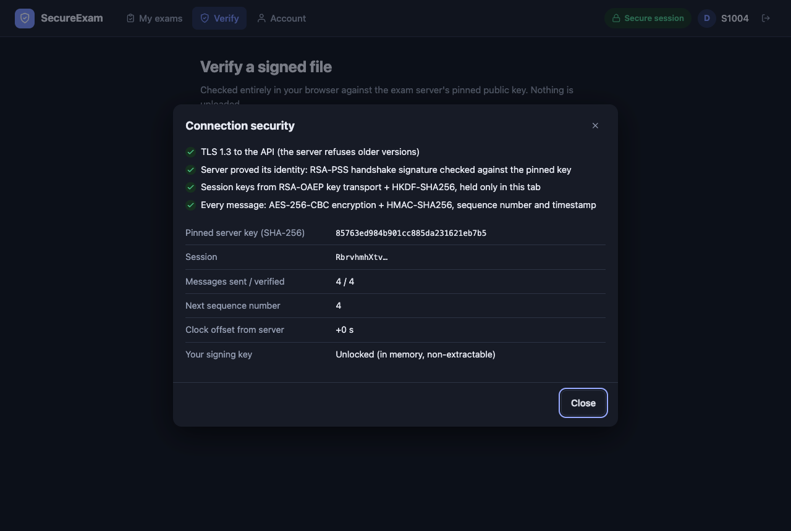<br><b>Connection security</b>: live session details: pinned server key, sequence numbers, clock offset, key state.</td>
</tr>
<tr>
<td width="50%" valign="top">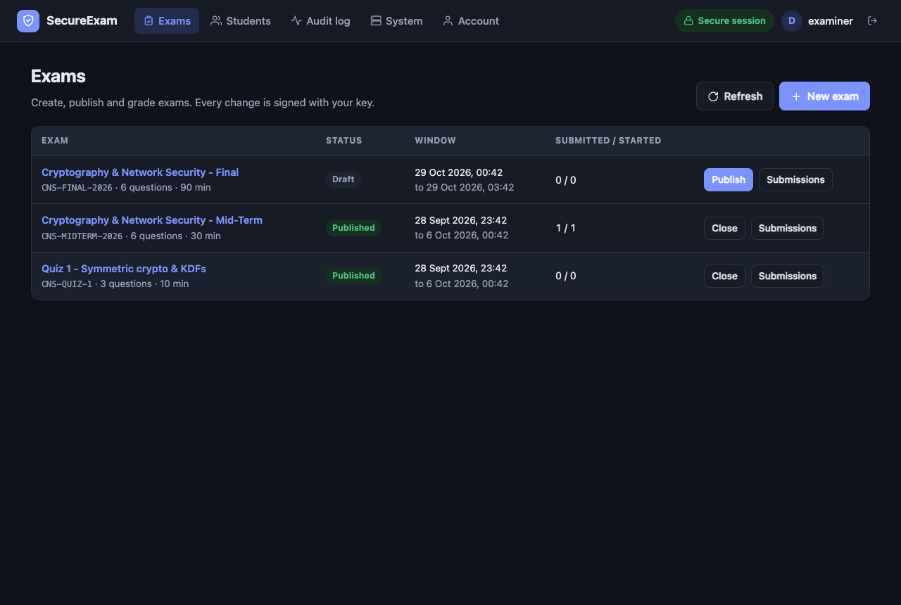<br><b>Examiner console</b>: publish, close and release exams. Every change is an RSA-signed admin action.</td>
<td width="50%" valign="top">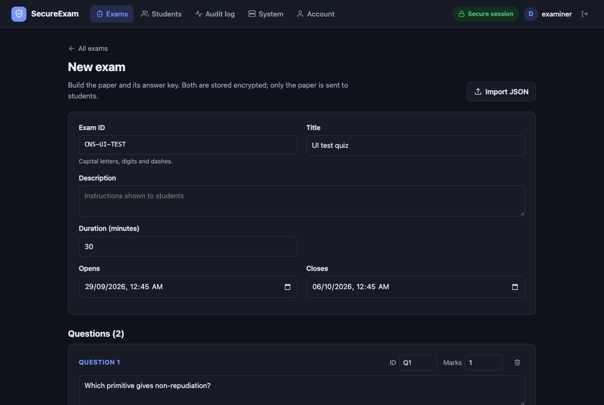<br><b>Exam builder</b>: the paper and its answer key are stored encrypted. Only the paper is sent to students.</td>
</tr>
<tr>
<td width="50%" valign="top">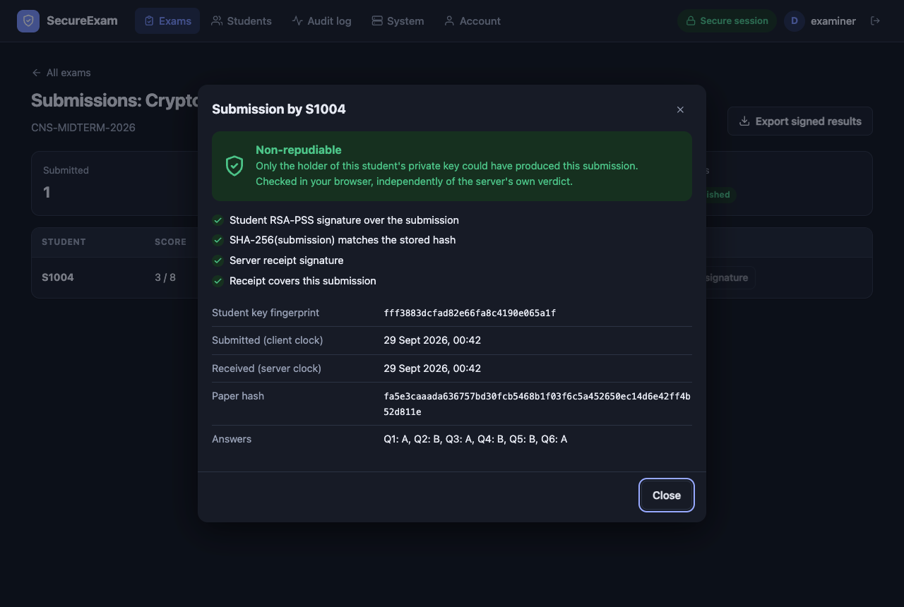<br><b>Non-repudiation check</b>: the examiner's browser checks the student's signature, independently of the server.</td>
<td width="50%" valign="top">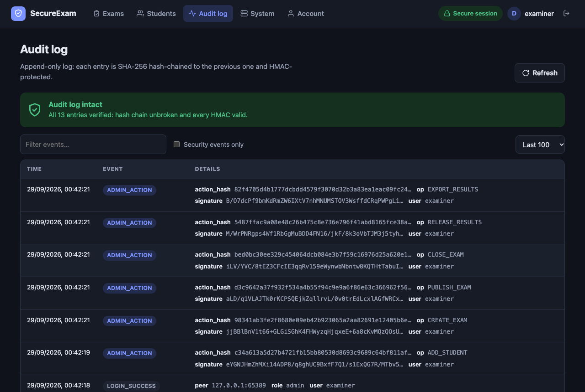<br><b>Audit log</b>: a hash-chained, HMAC-protected log, verified on every view.</td>
</tr>
</table>

<p align="center">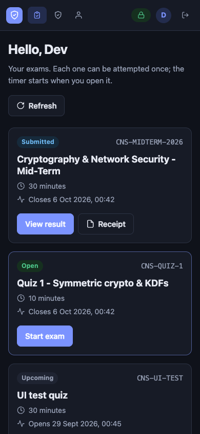<br><b>Mobile</b>: every screen also works at phone width.</p>

---

## Quick start

```bash
pip install -r requirements.txt          # or: pip install -e .  (adds secure-exam-* commands)

# 1. Create the CA, certificates, server keys, encrypted databases and demo data
python -m secure_exam.init_system

# 2. Start the server (terminal 1): TLS socket on :8443, HTTPS API on :8444, web app on :5173
python -m secure_exam.server

# 3. Web app: open https://localhost:5173 (see "Web frontend" below about the certificate)
#    Optional landing page: npm install && npm run dev, then open http://localhost:3000

# 4a. Student CLI (terminal 2)
python -m secure_exam.client                     # log in, sit exams, view results
python -m secure_exam.client --transport https   # same thing over the HTTPS API

# 4b. Examiner CLI (terminal 3)
python -m secure_exam.admin exams list
python -m secure_exam.admin shell                # interactive examiner session
```

### Web frontend

The server serves the app at **https://localhost:5173** alongside the API. The certificates come from the project's own CA ("Secure Exam Root CA", created by `init_system`). Until the browser trusts that CA, it shows *"Your connection is not private"*. Either:

- **Trust the CA (recommended).** This gives a real padlock on both ports.
  - macOS: `security add-trusted-cert -r trustRoot -k ~/Library/Keychains/login.keychain-db data/pki/ca_cert.pem`. Enter your Mac password, then quit Chrome with Cmd+Q and reopen it.
  - Windows: `certutil -user -addstore Root data\pki\ca_cert.pem`.
  - Firefox: Settings → Privacy & Security → View Certificates → Authorities → Import.
- **Or accept the warning once per port.** Open https://localhost:8444/api/v1/health and https://localhost:5173, then choose Advanced → Proceed. Do the API first, or sign-in fails with a network error.

Remove the trust when you are done. On macOS: `security delete-certificate -c "Secure Exam Root CA" ~/Library/Keychains/login.keychain-db`. Running `init_system --force` creates a new CA, which must be trusted again. Keep `data/pki/ca_key.pem` private: anyone holding it can issue certificates your browser trusts.

Screens:

| Role | Screens |
|---|---|
| Anyone | Sign in · Activate account · Verify a receipt, result or export file offline |
| Student | My exams · Timed exam with autosave and auto-submit · Signed receipt · Signed result |
| Examiner | Exams (publish, close, release) · Exam builder · Submissions with in-browser signature checks · Signed JSON/CSV export · Students (add, reissue, disable, unlock) · Audit log · Storage-key rotation |
| Both | Account: import, back up or remove the signing key, change password |

How the browser client is protected:

- **Pinned server key.** `/config.js` carries the server's RSA public key. The handshake transcript, papers, receipts, results and exports are all verified against it, so a forged server or a MITM inside TLS is rejected.
- **Same channel as the CLI.** RSA-OAEP key transport, HKDF, then AES-256-CBC + HMAC-SHA256 envelopes with sequence numbers and a freshness window.
- **Keys stay on the device.** Keys are generated in the browser at activation and stored in IndexedDB only as encrypted PKCS#8 (PBKDF2 at 600 000 rounds, then AES-256). Once unlocked, a key lives in memory as a non-extractable `CryptoKey`. Key files from the CLI can be imported, and browser key files work with the CLI.
- **Strict page security.** Content-Security-Policy with no inline script or style and `connect-src` limited to the API. The page also sends HSTS, `frame-ancestors 'none'`, `no-referrer` and `nosniff`. The page never uses `innerHTML`, so server data cannot inject markup.
- **Per-tab sessions.** Session keys are kept in `sessionStorage`, so a reload resumes the session but closing the tab ends it.

To serve the app separately, use `python -m secure_exam.server --no-web` plus `python -m secure_exam.web`. The app must be served from the origin in `SECURE_EXAM_ALLOWED_ORIGIN`.

### Demo data

| Account | Role | Password | Notes |
|---|---|---|---|
| `examiner` | Examiner (Dr. Meera Nair) | `Secure#Exam2026` | Signs every administrative action with an RSA key |
| `S1001` | Student (Alice Kumar) | `Alice@Exam2026` | Enrolled |
| `S1002` | Student (Bala Raman) | `Bala@Exam2026` | Enrolled |
| `S1003` | Student (Chitra Iyer) | `Chitra@Exam2026` | Enrolled |
| `S1004` | Student (Dev Patel) | none yet | Pending; enroll with code `DEMO-ENRL-CODE-2026` |

| Exam | Status |
|---|---|
| `CNS-MIDTERM-2026` | Published, open for 7 days, 30 min, 6 questions (8 marks) |
| `CNS-QUIZ-1` | Published, open for 7 days, 10 min, 3 questions |
| `CNS-FINAL-2026` | Draft; students cannot see it |

To wipe everything and start over, run `python -m secure_exam.init_system --force`. To create only the keys and the examiner account, add `--no-demo`.

### A complete exam cycle

```bash
# Examiner: register a student and hand them the one-time code out of band
python -m secure_exam.admin students add S2001 "Eve Joseph" --email eve@university.edu

# Student: activate the account. The RSA key pair is generated on the student's machine.
python -m secure_exam.client enroll

# Examiner: create, review and publish an exam (relative times such as "now" and "+2d" are allowed)
python -m secure_exam.admin exams create examples/sample_exam.json
python -m secure_exam.admin exams show CNS-QUIZ-2
python -m secure_exam.admin exams publish CNS-QUIZ-2

# Student: sit the exam (menu option 2). A server-signed receipt is saved locally.
python -m secure_exam.client
python -m secure_exam.client verify-receipt data/clients/S2001_CNS-QUIZ-2_receipt.json

# Examiner: check a submission's signature, close the exam, release results, export
python -m secure_exam.admin submissions list CNS-QUIZ-2
python -m secure_exam.admin submissions verify CNS-QUIZ-2 S2001
python -m secure_exam.admin exams close CNS-QUIZ-2
python -m secure_exam.admin exams release CNS-QUIZ-2
python -m secure_exam.admin results export CNS-QUIZ-2 --out results.json --csv results.csv
python -m secure_exam.admin verify-export results.json          # offline, no login

# Operations
python -m secure_exam.admin audit --limit 30      # verifies the audit hash chain and HMACs
python -m secure_exam.admin rotate-key            # re-encrypts all databases under a new AES key
python -m secure_exam.admin unlock S1001          # clear a brute-force lockout
python -m secure_exam.admin students reissue S1001   # lost key: revoke and issue a new code
```

### Testing and evaluation

```bash
python -m secure_exam.attacks      # 40 attack simulations against both transports
python -m secure_exam.evaluate     # full evaluation; writes reports/security_evaluation.md
python -W error::ResourceWarning -m unittest discover -s tests -t . -v    # 64 tests
```

The suite includes [tests/test_web_client.py](tests/test_web_client.py). It checks the web server's headers and path handling, and runs the browser modules under Node ([tests/web_client_test.mjs](tests/web_client_test.mjs)) against a live server. That run shows the WebCrypto code interoperates byte for byte with Python: keys, handshake, envelopes, signatures and receipts. The Node part is skipped when Node 20+ is not installed.

Attacks and evaluation run in a **temporary sandbox**: fresh keys and databases, with both servers on random ports. Your `data/` directory is never touched.

### Landing page (React)

The project also has a React + Vite landing page at the repository root: `src/`, `index.html` and `vite.config.ts`. It introduces the system and links to the exam web app, as shown in [Screenshots](#screenshots). It performs no cryptography and needs Node 18+.

```bash
npm install
npm run dev          # http://localhost:3000
npm run build        # type-checks, then writes dist/
```

The page checks the API's health through the Vite proxy. The proxy verifies the server certificate against `data/pki/ca_cert.pem`. If the exam server runs on non-default ports, point the page at them:

```bash
VITE_WEB_APP_URL=https://localhost:8445 VITE_API_URL=https://localhost:8444 npm run dev
```

---

## Architecture

```
┌─── Student / examiner client (CLI or web) ──┐            ┌──────────────── Exam server ─────────────────┐
│ • trusts the system CA (TLS)                │  TLS 1.3   │ server.py  TLS socket transport   :8443      │
│ • pins the server's RSA public key          │◄──────────►│ api.py     HTTPS JSON API         :8444      │
│ • own RSA key, encrypted with the password  │            │      └──► service.py (roles, exams, grading) │
│   (generated on the device at enrollment)   │            │ • AES-256-GCM encrypted databases            │
└─────────────────────────────────────────────┘            │ • hash-chained, HMAC'd audit log             │
                                                            └──────────────────────────────────────────────┘
```

### Protection layers (outermost first)

| # | Layer | Mechanism | Objective |
|---|-------|-----------|-----------|
| 1 | Transport | TLS 1.3 only (1.2 refused), CA-issued server certificate, hostname verification; HSTS, CSP, strict CORS and no-store on the API | Secure communication |
| 2 | Key exchange | The client sends a random 256-bit master secret under **RSA-OAEP**. The server proves its identity by signing the handshake with **RSA-PSS**, checked against a pinned key. Session keys come from **HKDF-SHA256** over the master secret and both nonces. | Key management, server authentication |
| 3 | Message channel | **AES-256-CBC** plus **HMAC-SHA256** (encrypt-then-MAC) over direction, sequence number, timestamp, IV and ciphertext. Any violation ends the session. | Confidentiality, integrity, replay protection |
| 4 | Accounts | **PBKDF2-HMAC-SHA256** (600,000 iterations, per-user salt), timing-safe login, lockout after 5 failures, one active session per account, password policy, 3 h session lifetime. Enrollment uses a one-time 80-bit code plus RSA proof-of-possession. | Authentication |
| 5 | Authorisation | Separate student and examiner roles. Every examiner state change is an **RSA-PSS signed action** with a timestamp and single-use nonce. | Authentication, non-repudiation |
| 6 | Application data | The server signs papers, receipts, results and exports; students sign their answers with their own key; papers are bound by a SHA-256 hash; question order is shuffled per student. | Integrity, non-repudiation |
| 7 | Storage | Every database is encrypted with **AES-256-GCM**, with the file name as associated data. The storage and audit keys are **RSA-OAEP wrapped**, and the storage key can be rotated. | Confidentiality at rest, key management |
| 8 | Auditing | Append-only log: each entry is SHA-256 hash-chained to the previous one and HMAC'd. It records every attack, login, failure and signed examiner action. | Attack detection, accountability |

### Session protocol

```
Client                                                   Server
  │─── TLS 1.3 handshake (verify cert chain + hostname) ───│
  │── HELLO {client_nonce, RSA-OAEP(server_pub, master)} ─►│
  │◄─ HELLO_OK {server_nonce, RSA-PSS(transcript)} ────────│  client verifies with pinned key
  │     k_enc ‖ k_mac = HKDF(master, client_nonce ‖ server_nonce)
  │══ LOGIN {user_id, password, role} ════════════════════►│  PBKDF2 check, lockout
  │══ GET_EXAM {exam_id} ═════════════════════════════════►│  starts the timer
  │◄═ signed {exam, SHA-256(exam), issued_to, deadline} ═══│  client verifies signature + hash
  │══ SUBMIT {answers, exam_hash, …} + student signature ═►│  server verifies student signature
  │◄═ signed receipt {SHA-256(submission), received_at} ═══│  client verifies and saves receipt
  │            … examiner releases results …               │
  │══ GET_RESULT {exam_id} ═══════════════════════════════►│
  │◄═ signed {score, total, submission_hash} ══════════════│
```

`══` = SecureChannel envelope `{seq, ts, iv, ct, mac}`. On HTTPS the handshake is `POST /api/v1/handshake` and each `══` is a `POST /api/v1/rpc`. The full specification, with WebCrypto code, is in [docs/API.md](docs/API.md).

### Exam lifecycle

```
examiner:  CREATE_EXAM ──► draft ──PUBLISH──► published ──CLOSE──► closed
                                                  │                  │
student:              (window opens) GET_EXAM ─► in progress ─SUBMIT─► submitted
                                                  │
examiner:                                 RELEASE_RESULTS ──► students can fetch signed results
```

Each student gets one attempt. The timer runs from their first `GET_EXAM` and is capped at the exam's closing time, with a 30 s grace period for submission.

---

## How each objective is met

| Objective | Where |
|-----------|-------|
| 1. Secure authentication | [service.py](secure_exam/service.py) `login` / `enroll`: PBKDF2, lockout, timing-safe comparison, role checks, one session per account, password policy, one-time enrollment codes with proof-of-possession |
| 2. Confidentiality (AES) | AES-256-CBC channel in [protocol.py](secure_exam/protocol.py); AES-256-GCM at rest in [storage.py](secure_exam/storage.py) |
| 3. Secure key management (RSA) | RSA-OAEP session-key transport; RSA-wrapped storage and audit keys; storage-key rotation; user keys generated on the client and stored as password-encrypted PKCS#8, re-wrapped on password change |
| 4. Data integrity (SHA-256 / HMAC) | HMAC on every message; SHA-256 exam and submission hashes; GCM tags on stored files; HMAC'd hash chain on the audit log |
| 5. Non-repudiation | Students sign their answers; the examiner signs every administrative action; the server signs papers, receipts, results and exports. `admin submissions verify` and `client verify-receipt` check these offline. |
| 6. Secure communication (TLS) | TLS 1.3 with a private CA ([pki.py](secure_exam/pki.py)) on both transports, plus HTTP security headers on the API |
| 7. Attack detection | 40 scenarios in [attacks.py](secure_exam/attacks.py); every detected attack is audit-logged, and the server refuses to start if the audit log has been tampered with |
| 8. Security evaluation | [evaluate.py](secure_exam/evaluate.py): known-answer tests, property checks, TLS inspection, API header checks, plaintext-leak scan, the end-to-end lifecycle on both transports, benchmarks, and the [report](reports/security_evaluation.md) |

### Attack scenarios tested

| Category | Attacks | Stopped by |
|----------|---------|-----------|
| Tampering | Bit-flip in a socket message; changed sequence number; changed IV in an HTTPS envelope | HMAC over header + IV + ciphertext |
| Tampering | Answers changed after signing; exam paper modified in transit | Student / server RSA-PSS signatures |
| Tampering | Edited database file; one database file swapped for another | AES-GCM tag; file name bound as associated data |
| Tampering | Audit-log entries deleted | Hash chain + HMAC |
| Replay | Captured request replayed (socket and HTTPS); whole session replayed on a new connection; stale message | Sequence numbers; fresh server nonce; timestamp window |
| Replay | Second submission; replayed or hour-old examiner action | One attempt per student; action nonce + timestamp |
| Unauthorized access | No login; wrong password; brute force; concurrent login with stolen credentials | Session checks, PBKDF2, lockout, one session per account |
| Unauthorized access | Hijacked HTTPS `session_id`; guessed `session_id` | Session keys never leave the client; unknown sessions rejected |
| Unauthorized access | Submitting as another student; signing with an unregistered key | Identity bound to session; registered public key |
| Unauthorized access | Student calls examiner operations; examiner action signed with the wrong key (password stolen, key not) | Role check; examiner signature verification |
| Unauthorized access | Result before release; draft exam; exam before its window | Exam state machine |
| Unauthorized access | Guessed enrollment code; enrolling someone else's key; reusing a consumed code; weak password | Code hash + lockout; proof-of-possession; single-use codes; password policy |
| Unauthorized access | Plain TCP; plain HTTP; TLS 1.2 downgrade | TLS 1.3 required on both ports |
| MITM | Certificate from an untrusted CA; impostor server holding a stolen TLS key | Certificate verification; pinned-key handshake signature |
| Key management | Using a leaked storage key after rotation | Re-encryption under a new RSA-wrapped key |
| Non-repudiation | Student denies submitting; examiner denies an action | Stored signatures; signed actions in the audit log |

**Threat model for channel attacks:** the attacker sits *inside* the TLS tunnel, for example a compromised proxy or malware on the client machine, and can capture, modify and re-inject frames. TLS alone already stops an attacker on the network path. These tests show the application layer still holds if that outer layer is bypassed.

---

## Project layout

```
secure_exam/
  config.py        paths, ports, security parameters (overridable via env vars)
  crypto_utils.py  AES-CBC/GCM, RSA-OAEP/PSS, SHA-256, HMAC, HKDF, PBKDF2, canonical JSON
  protocol.py      framing, handshake, SecureChannel (encrypt-then-MAC + anti-replay)
  pki.py           X.509 CA and TLS server certificate generation
  storage.py       encrypted JSON stores, wrapped keys, key rotation, tamper-evident audit log
  service.py       business logic shared by both transports: roles, enrollment, exams, grading
  server.py        TLS socket transport + entry point that starts both transports
  api.py           HTTPS JSON API for web frontends
  web.py           static HTTPS server for the web app (CSP, HSTS, pinned-key /config.js)
  client.py        ExamClient library (socket or HTTPS) + student CLI + receipt verifier
  admin.py         examiner CLI (signed actions, submission verification, signed exports)
  init_system.py   one-time setup + demo data
  attacks.py       attack simulations
  evaluate.py      security evaluation and report generator
frontend/          web app (no build step): index.html, css/app.css, js/
  js/crypto.js     WebCrypto: RSA-OAEP/PSS, AES-CBC, HMAC, HKDF, PBKDF2, encrypted PKCS#8, canonical JSON
  js/channel.js    SecureSession: handshake + encrypted, MAC'd, sequenced envelopes
  js/client.js     ExamClient: verified papers, signed submissions, receipts, results, admin actions
  js/keystore.js   IndexedDB storage for encrypted keys and receipts
  js/app.js        routing, sign-in, activation, account, file verification
  js/student.js    exam list, timed exam, receipt and result screens
  js/admin.js      examiner console: exams, builder, submissions, students, audit, system
docs/API.md        protocol and API reference for frontend developers
docs/screenshots/  UI screenshots used in this README
src/               React + Vite landing page (App.tsx, lycoris-specimen WebGL visual, lib/links.ts)
index.html, vite.config.ts, package.json   landing page entry, dev server + health proxy, npm deps
examples/          sample exam definition for `admin exams create`
tests/             unittest suite (primitives, channel, validation, lifecycle, all attacks, web client)
data/              generated at runtime (git-ignored): keys, certs, encrypted DBs, audit log
reports/           generated evaluation report
```

## Configuration

Environment variables:

| Variable | Default | Purpose |
|---|---|---|
| `SECURE_EXAM_DATA` | `./data` | Data directory |
| `SECURE_EXAM_HOST` | `127.0.0.1` | Bind / connect address |
| `SECURE_EXAM_PORT` | `8443` | TLS socket port |
| `SECURE_EXAM_API_PORT` | `8444` | HTTPS API port |
| `SECURE_EXAM_WEB_PORT` | `5173` | Web frontend port |
| `SECURE_EXAM_ALLOWED_ORIGIN` | `https://localhost:5173` | Only origin allowed by CORS (the web frontend) |

Security parameters live in [config.py](secure_exam/config.py): `PBKDF2_ITERATIONS`, `MAX_CLOCK_SKEW`, `MAX_FAILED_LOGINS`, `LOCKOUT_SECONDS`, `SESSION_TTL`, `API_SESSION_IDLE`, `ENROLLMENT_CODE_TTL`, `SUBMISSION_GRACE_SECONDS`, `PASSWORD_MIN_LENGTH`, and the RSA key sizes.

## Limitations

- The CA and server keys are generated locally. In production the server's private keys should live in an HSM or KMS, and the CA key should be kept offline.
- Lockout counters, active sessions and admin-action nonces are held in memory. A multi-instance deployment would need a shared store such as Redis.
- Each database is a single encrypted JSON file, rewritten on every change. That is fine for a class or department; a larger deployment needs a real database with per-record encryption.
- Enrollment codes are shown to the examiner, who delivers them out of band; the system does not send e-mail.
- Students authenticate with a password plus a device-bound signing key. A real deployment would add MFA and proctoring.
- In the web app, the page's JavaScript comes from the server being verified, so a fully compromised server could serve altered code. The CLI clients don't share this weakness. The CSP, pinned key and same-origin serving make tampering in transit or by injection hard, but they cannot protect against the server itself.
- Exams are multiple choice and auto-graded. The answer key is never sent to clients, even with results.
